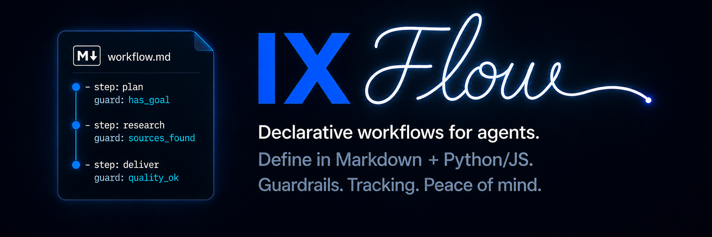

[](https://discord.gg/6qsdhSPE)

<p align="center">
  
</p>

# IX Flow

`ix-flow` is the Agent IX workflow lifecycle runner. An agent runs a workflow — defined as
a small state machine of phases, transitions, and human gates — by calling `ix-flow` to
track where the run is, advance it, and pause for human approval. Runs persist, so an agent
can resume one across sessions.

## The pattern: define a flow, then create a skill to run it

1. **Define a flow** — a `def.yaml` describing phases, transitions, gates, and invariants.
2. **Create a skill** — a `SKILL.md` that points at the flow and tells the agent how to
   drive it (start from status, follow the next actions, record progress, stop at gates).
3. **An agent runs it** — the agent invokes the skill and calls `ix-flow` to create a run
   and advance it through the flow, pausing where a human gate requires approval.

[`ix-spec`](https://github.com/agent-ix/ix-spec) is a real consumer: `ix-spec review`
launches a spec-review flow and hands lifecycle control to `ix-flow`.

## Install

```bash
npm i -g @agent-ix/ix-flow
```

## Quickstart

Run the bundled [`examples/release`](examples/release) flow — `draft → in_review →
approved`, with a human gate on the final step. The agent drives the run with `ix-flow`:

```bash
# Create a run from a workflow skill.
ix-flow run release --path examples/release
# create: ok
# run: <run-id>
# phase: draft

# Advance through the flow's phases.
ix-flow advance <run-id> in_review
# phase: in_review

# The final transition is a human gate; it pauses and reports the gate token.
ix-flow advance <run-id> approved
# advance: gate_deferred
# gate: ack_... (to approved)
# next: ix-flow ack <run-id> ack_... --reviewer <user>

# A human approves; the run continues to the terminal phase.
ix-flow ack <run-id> <token> --reviewer alice
ix-flow advance <run-id> approved
# phase: approved
```

Agents read machine output by adding `--json` to any command (see
[`docs/usage.md`](docs/usage.md)).

## Commands

| Command                     | Purpose                                                    |
| --------------------------- | ---------------------------------------------------------- |
| `run <flow> [--path <dir>]` | Create a run from a registered definition or skill dir.    |
| `status <run-id>`           | Show current phase, open gates, and next actions.          |
| `resume <run-id>`           | Pick a run back up (e.g. in a new agent session).          |
| `advance <run-id> <phase>`  | Move to the next phase (may pause on a gate or invariant). |
| `ack <run-id> <token>`      | Record human approval for a paused gate.                   |
| `history <run-id>`          | Show the run's event log.                                  |

## Concepts

- **Flow** — a workflow definition: phases, transitions, gates, invariants (`def.yaml`).
- **Run** — one live instance of a flow, identified by a run id.
- **Phase** — a named state; a run sits in exactly one phase at a time.
- **Transition** — a declared `from → to` move the agent makes with `advance`.
- **Gate** — a `hitl` transition pauses for human approval, recorded with `ack`.
- **Invariant** — a predicate that must hold before a transition succeeds.
- **State** — each run is an append-only, hash-chained event log under `~/.ix/flows`.

See [`docs/usage.md`](docs/usage.md) to author your own flow and skill.

## Development

```bash
pnpm install
pnpm run build
pnpm test
pnpm run lint
```

This package builds on `@agent-ix/ix-cli-core` from the standalone `ix-cli-core` repo.
