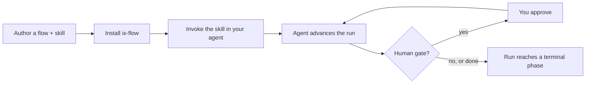
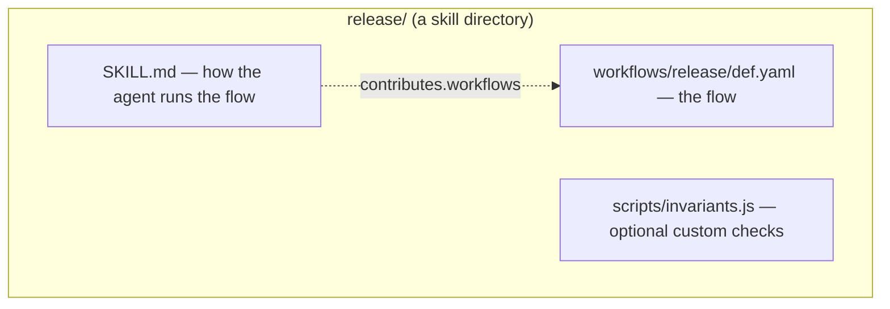
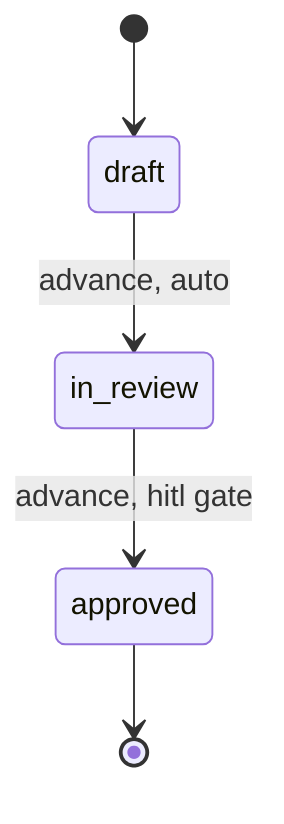
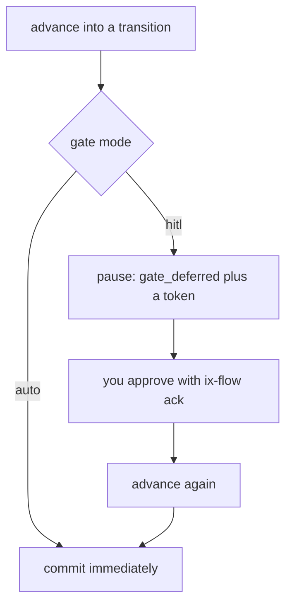
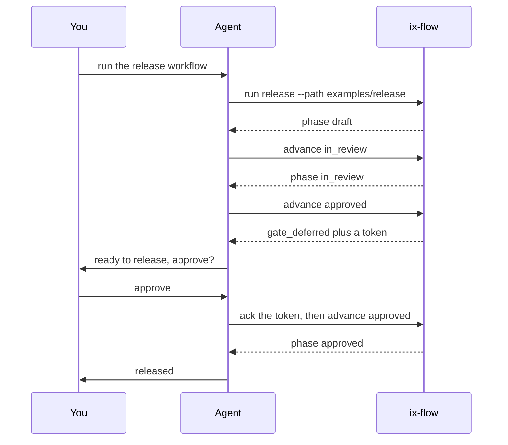
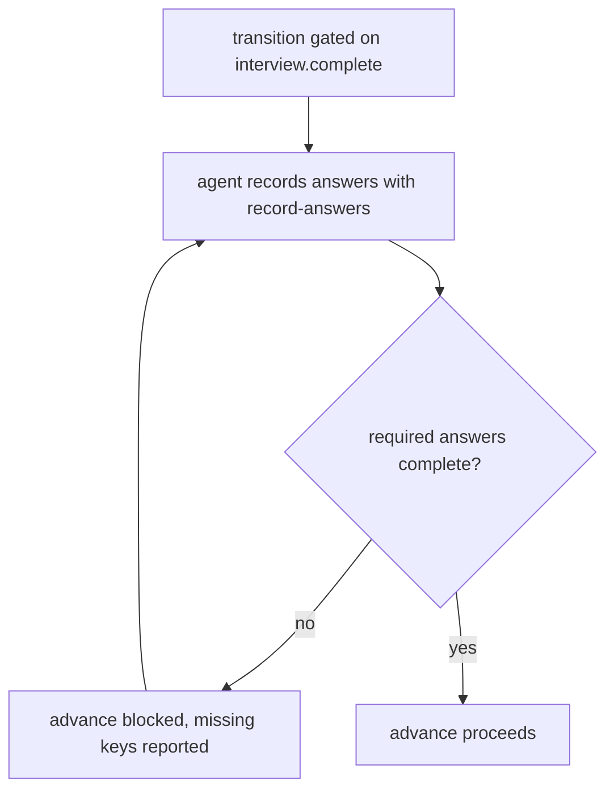
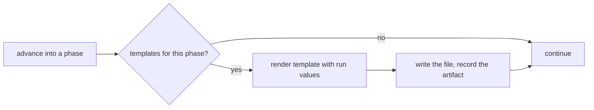

# ix-flow user guide

`ix-flow` runs agent workflows. A workflow is a small state machine — phases, transitions,
and human gates — that your agent advances step by step, pausing for your approval where it
matters. You **author** a workflow; your **agent runs it** by calling `ix-flow`.

This guide walks the whole arc: install it, author a flow and the skill that runs it, and
use it through your agent. It also covers gates, invariants, interviews, templates, and the
full command reference your skill draws on.

## Overview

A workflow is two things you author — a **flow** (the state machine) and a **skill** (the
instructions your agent follows). You install ix-flow, make the skill available to your
agent, and invoke it. From there the agent drives the run, stopping only when a gate needs
your approval.



## Install

Install the CLI your agent calls:

```bash
npm i -g @agent-ix/ix-flow
```

Then install the Claude Code plugin, which adds the `/ix-flow` and `/ix-flow-create`
commands:

```text
/plugin marketplace add agent-ix/ix-flow
/plugin install ix-flow@ix-flow
```

The plugin ships two skills: **ix-flow** runs a workflow, and **ix-flow-create** authors a
new one. Author your own workflow below, or install one — like
[`ix-spec`](https://github.com/agent-ix/ix-spec) — that ships its own.

## Anatomy of a workflow

A workflow lives in a **skill directory**: the flow definition plus the skill that tells the
agent how to run it.



- **The flow** (`def.yaml`) declares the phases and the legal moves between them.
- **The skill** (`SKILL.md`) declares where the flow lives and tells the agent how to drive
  it.
- **Custom invariants** (`scripts/invariants.js`, optional) add checks the engine enforces
  before a move.

A complete, runnable example is in [`examples/release`](../examples/release); an
interview-gated example is in [`examples/intake`](../examples/intake).

## Phases and transitions

A run is always in exactly one **phase**, starting at `initialPhase`. Your agent moves it
between phases along declared **transitions** with `advance`. A phase marked `terminal` is
an end state. Here is the `release` flow:



```yaml
name: release
version: 0.1.0
initialPhase: draft
phases:
  - { name: draft }
  - { name: in_review }
  - { name: approved, terminal: true }
transitions:
  - { from: draft, to: in_review, defaultGate: auto }
  - { from: in_review, to: approved, defaultGate: hitl } # pauses for approval
```

Advancing to a phase that no transition declares is rejected, so the flow defines exactly
which moves are possible.

## Gates and approval

Each transition has a gate mode. `auto` commits immediately. `hitl` pauses the run for a
human: `advance` reports `gate_deferred` with a token, you approve with `ack`, and the next
`advance` commits the move.



A third mode, `full-auto`, is accepted by the definition but currently behaves like `auto`;
it is reserved for future use.

## Invariants

An **invariant** is a named check that must pass before a transition commits. If it fails,
the run stays put and the agent sees a structured reason. List invariants on a transition:

```yaml
transitions:
  - from: draft
    to: in_review
    invariants: ["no_open_questions"]
    defaultGate: auto
```

Built-in invariants:

| Name                      | Holds when                                            |
| ------------------------- | ----------------------------------------------------- |
| `acyclic`                 | The run's item links contain no dependency cycle.     |
| `no_open_questions`       | The run has no unresolved open questions.             |
| `interview.complete:<id>` | Interview `<id>`'s required answers are all recorded. |

Add your own by exporting an `invariants` object from `scripts/invariants.js`:

```js
export const invariants = {
  has_report: ({ instance }) =>
    instance.items.report?.length > 0 || { ok: false, code: "report_missing" },
};
```

Reference it by name (`invariants: ["has_report"]`). A failing custom invariant returns its
`code` and `details`, so the agent knows exactly what to fix.

## The run lifecycle

Putting it together: you invoke the skill, the agent creates a run and advances it, and you
step in only at the gate.



Runs persist under `~/.ix/flows`, so an agent can `resume` one in a later session, and
`history` plus `verify` let you audit exactly what happened.

## Interviews

An **interview** collects structured answers and gates a transition until they are complete.
Declare a question bank, gate a transition on `interview.complete:<id>`, and the agent
records answers with `record-answers` before it can advance.



```yaml
itemSchemas:
  request: {}
interviews:
  request:
    itemType: request
    completenessRule: all_required
    questions:
      - {
          key: title,
          prompt: "What is this called?",
          type: text,
          required: true,
        }
      - {
          key: summary,
          prompt: "What is being asked for?",
          type: text,
          required: true,
        }
transitions:
  - {
      from: collecting,
      to: drafting,
      invariants: ["interview.complete:request"],
    }
```

Question types are `text`, `list<text>`, `enum` (with `options`), `bool`, and `int`. A
`completenessRule` of `all_required` requires every `required` answer; `min_count:N`
requires N answered; `custom_invariant:NAME` delegates to your own check. A question may set
`followUpIf: nonEmpty` (or `empty`) to be re-surfaced later when its prior answer warrants.

## Artifact templates

A workflow can scaffold files as the run enters a phase. Declare an `artifactTemplates`
entry; on phase entry the engine renders the template to its target by pure variable
substitution and records the result on the run.



```yaml
artifactTemplates:
  report:
    source: templates/report.md
    target: reports/${items.request.request.title}.md
    phase: drafting
```

Templates substitute `${now}`, `${uuid}`, `${item.*}`, `${items.<type>.<id>.<field>}`,
`${instance.*}`, and `${project.*}` from run state — values only, never code. Targets
resolve inside your project directory, and templates require a path-mode skill (so the
engine can find the source).

## Author a workflow

`/ix-flow-create` scaffolds these files for you, or write them directly:

**1. Write the flow** at `workflows/<name>/def.yaml`. The full field set:

```yaml
name: <name> # workflow name
version: 0.1.0
description: <one line>
initialPhase: <first-phase> # must be one of the phases below
phases:
  - { name: <first-phase> }
  - { name: <last-phase>, terminal: true } # terminal ends the run
transitions:
  - from: <first-phase>
    to: <last-phase>
    invariants: [] # checks that must pass before the move
    defaultGate: auto # auto | hitl | full-auto
itemSchemas: {} # named item types this flow records
linkSchemas: {} # named link types between items
interviews: {} # optional question banks (see Interviews)
artifactTemplates: {} # optional phase-entry files (see Artifact templates)
recipes: {} # optional named command sequences (see Recipes)
```

**2. Write the skill** at `<name>/SKILL.md`. Its frontmatter points at the flow; its body is
the agent's playbook:

```markdown
---
name: <name>
description: What this workflow does.
contributes:
  workflows: ./workflows
---

# /<name>

Start from `ix-flow status` and follow the reported next actions. Advance the run through
its phases, recording progress as you go, and stop at human gates until they are approved.
```

**3. Smoke-test it:**

```bash
ix-flow run <name> --path <skill-dir>
```

Fix any `skill_format_invalid` or `definition_schema_invalid` errors it reports.

## Run a workflow

Run `/ix-flow <workflow>` and your agent drives the run — creating it, advancing through the
phases, recording interview answers, and pausing at gates for your approval:

```text
You:    /ix-flow release
Agent:  ▸ created run, advanced draft → in_review → reached the approval gate
        "Ready to release. Approve?"
You:    approve
Agent:  ▸ recorded approval, advanced to approved
        "Released."
```

The same pattern scales to real workflows — a spec review, a coding loop, a planning pass —
each authored as its own flow and skill. The agent applies the same lifecycle: create,
advance, gate, finish.

## Share a workflow

A workflow reaches an agent two ways:

- **Path mode** — point the agent at a skill directory with `--path <skill-dir>`. Best while
  authoring and iterating, and for project-local workflows you keep in your repo.
- **Name mode** — publish a set of workflows so the agent invokes them by name, with no
  filesystem path. Best for sharing a reusable workflow set across projects.

Either way, the agent drives the run the same; only how the flow is located differs.

## Command reference

These are the commands your skill instructs the agent to call. Every command accepts
`--json` (the agent reads the structured envelope) and the global flags below.

| Command                                                   | Purpose                                                |
| --------------------------------------------------------- | ------------------------------------------------------ |
| `run <flow> [--path <dir>] [--id] [--name] [--target]`    | Create a run from a definition name or skill dir       |
| `status <run-id>`                                         | Report current phase, open gates, next actions         |
| `resume <run-id>`                                         | Re-emit status to pick a run back up                   |
| `advance <run-id> <phase>`                                | Move along a transition (may pause on a gate)          |
| `ack <run-id> <token> [--reviewer --kind --note]`         | Record human approval for a paused gate                |
| `record-answers <run-id> <interview-id> --answers <json>` | Record interview answers (`--answers-file`, `--merge`) |
| `recipe <run-id> <recipe-name>`                           | Run a named multi-step recipe                          |
| `add-item <run-id> <type> --item <json>`                  | Record a typed item (`--item-file`)                    |
| `update-item <run-id> <type> <item-id> --patch <json>`    | Patch an item by id (`--patch-file`)                   |
| `link-items <run-id> --link <json>`                       | Record a typed link (`--link-file`)                    |
| `verify <run-id>`                                         | Check the run's event-log integrity                    |
| `history <run-id>`                                        | Show the run's event log                               |

Global flags: `--json`; `--state-dir <dir>` (default `~/.ix/flows`); `--config-root <dir>`
(default `~/.ix`).

### JSON output

With `--json`, every command returns the full result envelope. Key fields the agent reads:

```jsonc
{
  "ok": true,
  "command": "advance",
  "state": "gate_deferred", // ok | gate_deferred | invariant_failed | concurrency_conflict | error
  "current_phase": "in_review",
  "open_gates": [{ "token": "ack_…", "from": "in_review", "to": "approved" }],
  "next_actions": [{ "command": "ix-flow ack …", "description": "…" }],
  "events": [
    /* appended events */
  ],
}
```

`open_gates[].token` is what `ack` takes to clear a gate; `next_actions` are the suggested
follow-up commands.

## State

Each run is one JSON file under `~/.ix/flows`, persisting across agent sessions so a run can
be resumed and audited. To isolate a run (for example in tests), set `--state-dir`; to
relocate the whole `~/.ix` root, set `--config-root`.

```

```
